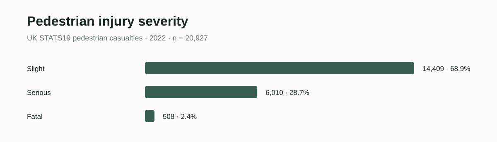
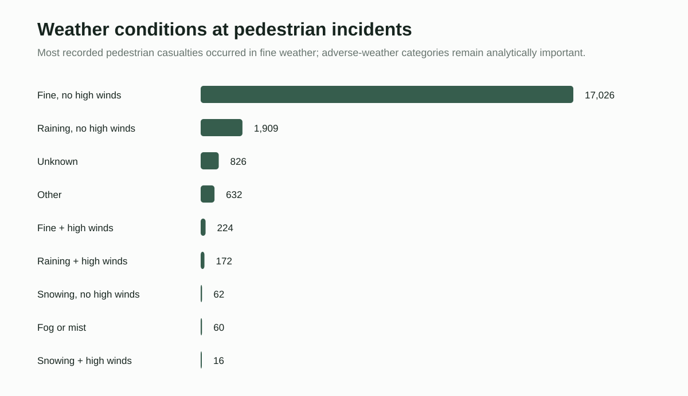
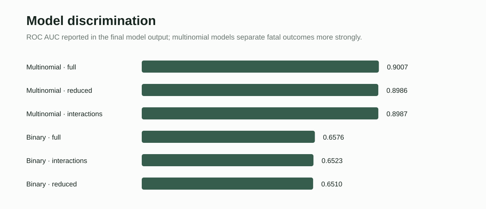

# Climate, Environment & Pedestrian Safety

A reproducible **UK STATS19** case study examining how environmental, road, temporal, and human factors relate to pedestrian injury severity.

## Project snapshot

- **Data:** UK STATS19 collision, casualty, and vehicle records (2022)
- **Analytic records:** 20,927 pedestrian casualties
- **Outcome:** casualty severity (Slight / Serious / Fatal), with a binary Fatal-or-Serious outcome for complementary models
- **Methods:** binary logistic regression, multinomial logistic regression, interaction specifications, ROC/AUC and confusion-matrix evaluation
- **Tools:** R, `stats19`, `dplyr`, `nnet`, `pROC`

## Results figures

### Injury severity distribution



### Weather context



### Model performance



### Injury severity

| Severity | Count | Share |
|---|---:|---:|
| Slight | 14,409 | 68.9% |
| Serious | 6,010 | 28.7% |
| Fatal | 508 | 2.4% |

Fatal or serious injuries account for **31.1%** of the analytic records.

### Model discrimination

The final model comparison reported the following ROC AUC values for predicting fatal outcomes:

| Specification | AUC |
|---|---:|
| Multinomial — full | **0.9007** |
| Multinomial — reduced | 0.8986 |
| Multinomial — interactions | 0.8987 |
| Binary — full | 0.6576 |
| Binary — interactions | 0.6523 |
| Binary — reduced | 0.6510 |

These are model-discrimination results, not causal effect estimates.

## Research framing

Pedestrian injury severity is modeled as the product of multiple interacting domains: weather, lighting, road-surface conditions, crossing infrastructure, speed limit, urban/rural setting, vehicle manoeuvre, casualty age and sex, and temporal context.

The climate-safety interpretation is deliberately cautious. Most recorded pedestrian casualties occurred in fine weather, so raw weather counts should **not** be interpreted as weather-specific risk. Exposure, infrastructure, behavior, and contextual factors must be considered jointly.

## Repository structure

```
.
├── R/
│   ├── 01_prepare_data.R
│   ├── 02_eda.R
│   └── 03_models.R
├── figures/
│   ├── severity-distribution.svg
│   ├── weather-distribution.svg
│   └── model-auc.svg
├── results/
│   ├── severity_summary.csv
│   ├── weather_summary.csv
│   └── model_auc.csv
└── README.md
```

## Workflow

1. Download 2022 STATS19 collision, casualty, and vehicle records.
2. Join records using `accident_index`.
3. Filter to pedestrian casualties.
4. Engineer time-of-day and fatal-or-serious indicators.
5. Explore severity across environmental and contextual conditions.
6. Fit binary and three-level multinomial severity models.
7. Compare specifications using ROC/AUC and classification diagnostics.

## Portfolio

See the companion case study on the [Yu Song portfolio](https://ys30.github.io/projects/extreme-weather-pedestrian-safety.html).

## Scope

This repository contains a cleaned, portfolio-oriented reconstruction of the analytical workflow and derived results. Student dissertation/assessment documents and personally identifying student material are intentionally excluded.
